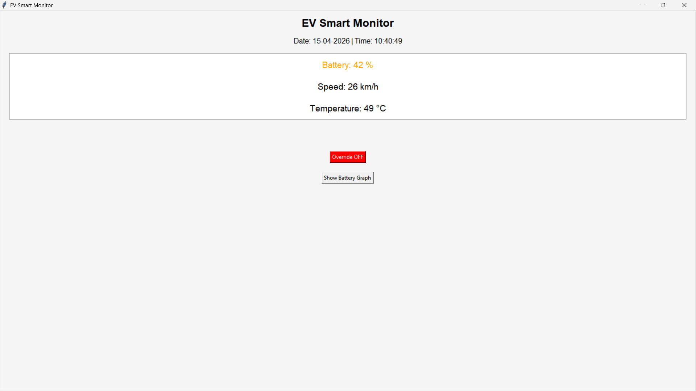
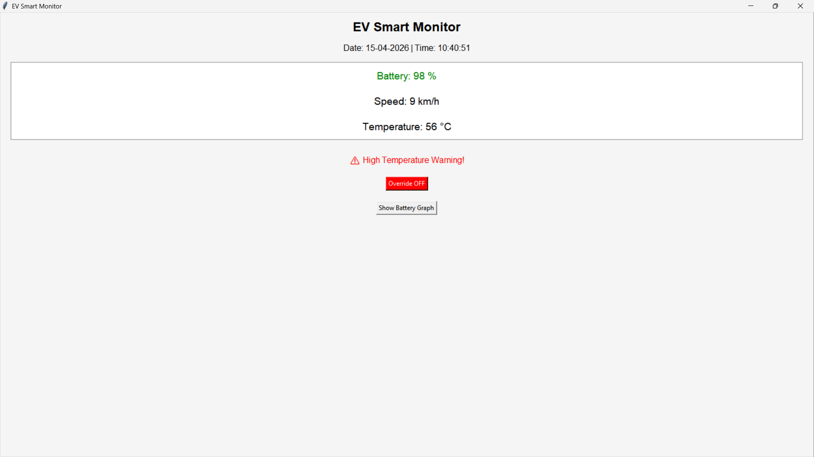
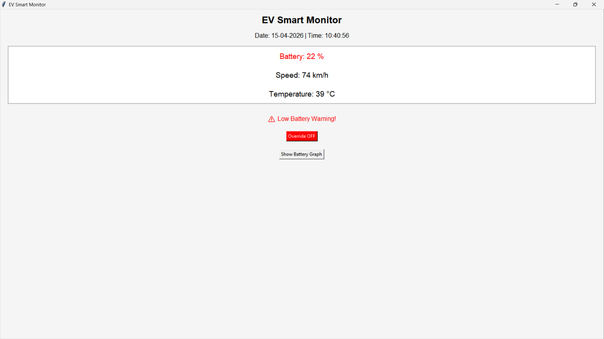
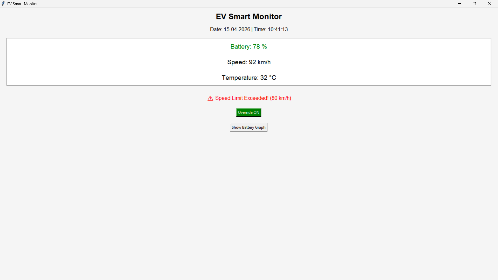
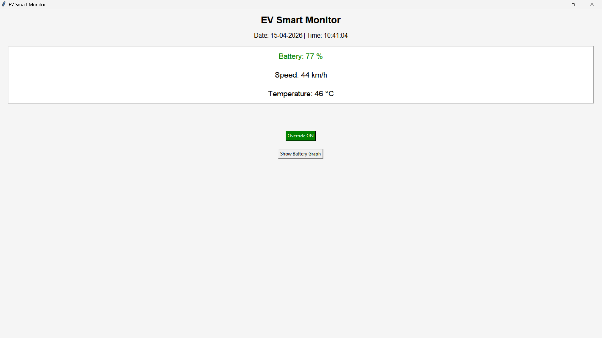
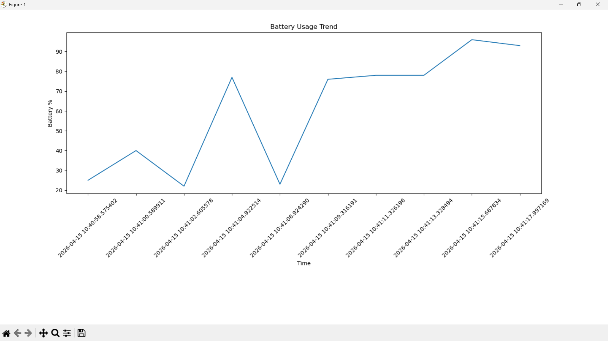

# ⚡ EV Smart Monitor

A Python-based GUI application to monitor Electric Vehicle (EV) parameters like Battery, Speed, and Temperature in real-time.

## 🚀 Features
- 🔋 Live Battery Monitoring
- 🚗 Speed Tracking with Safety Limit (80 km/h)
- 🌡️ Temperature Monitoring
- ⚠️ Alerts for:
  - Low Battery
  - High Temperature
  - Speed Limit Exceeded
- 📊 Battery Usage Graph (Matplotlib)
- 🌗 Auto Light/Dark Mode (Day/Night UI)
- 🕒 Real-time Date & Time Display

---

## 📁 Project Structure

EV-smart-monitor/
│── main.py
│── ev_data.csv
│── README.md
│── screenshots/

---

## 📸 Output

### Normal UI


### High Temperature Alert


### Low Battery Alert


### Speed Limit Alert


### Override Mode


### Battery Graph


---

## 🎯 Use Case
This project simulates a smart EV dashboard system that monitors vehicle performance and ensures safety using real-time alerts.

---

## 🔮 Future Improvements
- Mobile App Integration  
- GPS Tracking  
- Cloud Data Storage  
- AI-based Prediction  

---

## 👨‍💻 Author
Santosh Rathod
## 🛠️ Tech Stack
- Python
- Tkinter (GUI)
- Matplotlib (Graph)
- CSV (Data Logging)

## ▶️ How to Run
```bash
pip install matplotlib
python main.py
